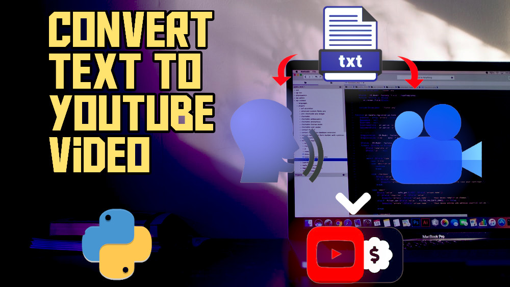

# Text to Video

## To setup and run
just clone the project and open text.txt file and add the text you want to make video, And run 
`~$ python3 app.py`

## MIT License

[MIT](LICENSE)
#### Copyright (c) 2020 Auto-Bot-Channel
#### Made by [Vaibhav Singh](https://github.com/itsvaibhav01)
